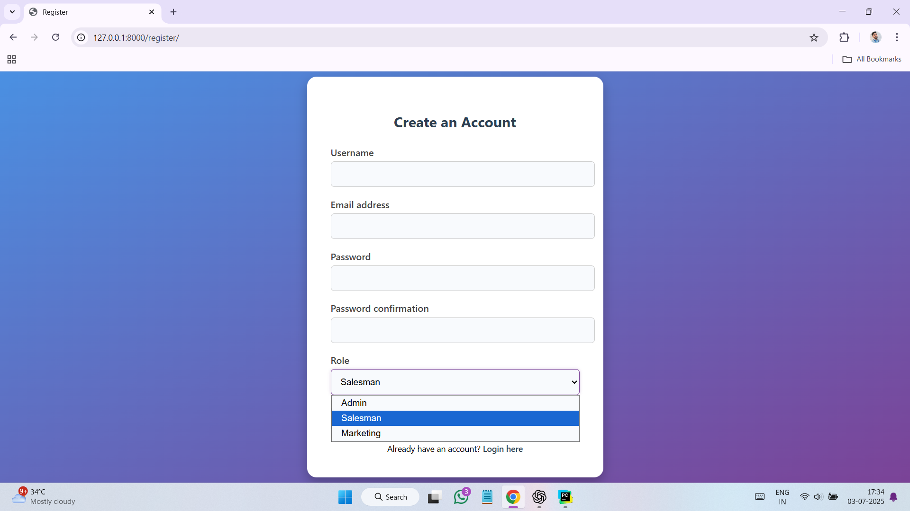
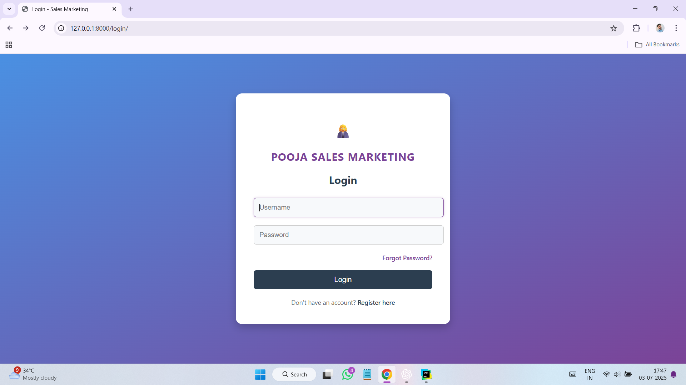
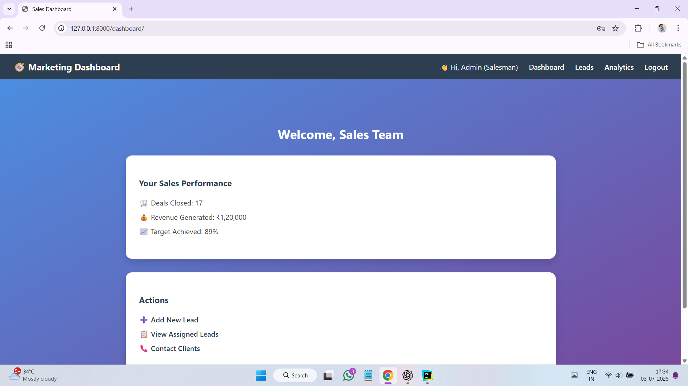
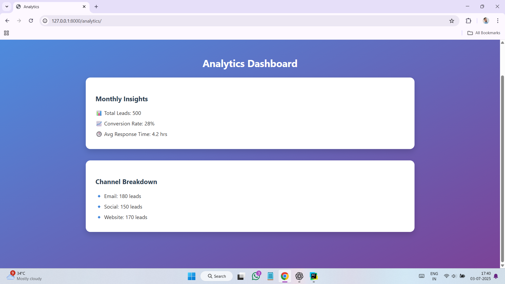
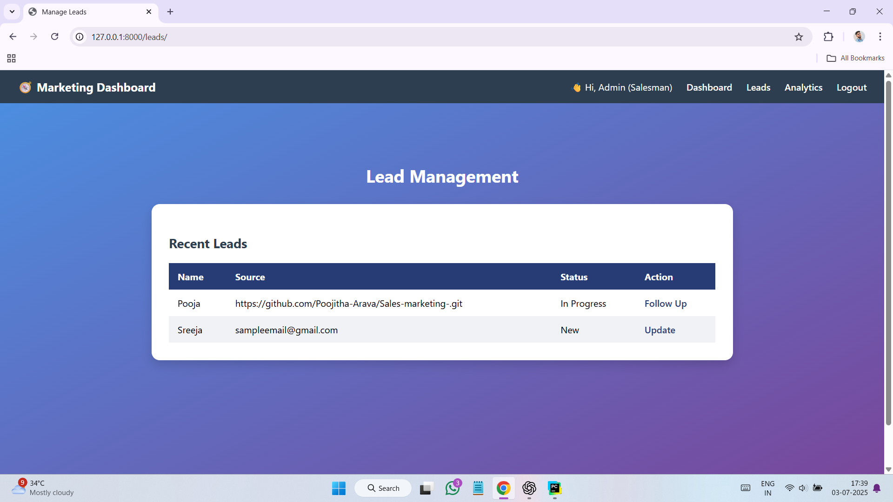

# 🧑‍💼 Sales & Marketing System

Welcome to the **Sales & Marketing System** – a Django-based web application designed to manage users, track sales activities, log marketing actions, and generate insights with a clean UI.

---

## 📸 Screenshots

### 🔐 Main Page


### 🔐 Register Page


### 🔐 Login Page


### 🔐 Reset Password Page


### 🧑‍💼 Admin Dashboard


### 📈 Analytics Dashboard


### 📣 Leads Dashboard


## 🚀 Features

- 🔐 User Registration & Login (with role-based access: Admin, Sales, Marketing)
- 📥 Admin Dashboard (manage users, view system logs, reports)
- 📈 Sales Dashboard (manage leads, status tracking)
- 📣 Marketing Dashboard (campaign creation, analytics)
- 📅 Activity Tracking & Task Management
- 💾 Secure Data Storage (SQLite or PostgreSQL)
- 🎨 Beautiful UI with responsive layout
- 📂 Role-wise Access Control

---

## 💻 Tech Stack

- **Backend:** Django 4+
- **Frontend:** HTML, CSS (custom + responsive design)
- **Database:** SQLite (can be upgraded to PostgreSQL)
- **Version Control:** Git + GitHub

---

## ⚙️ Setup Instructions

### Clone the Repository

```bash
git clone https://github.com/yourusername/sales_marketing.git
cd sales_marketing

Create a Virtual Environment
bash
python -m venv venv
venv\Scripts\activate     # On Windows
# OR
source venv/bin/activate  # On Mac/Linux

Install Dependencies
bash
pip install -r requirements.txt

Apply Migrations
bash
python manage.py migrate

Create Superuser
bash
python manage.py createsuperuser

Run the Development Server
bash
python manage.py runserver

